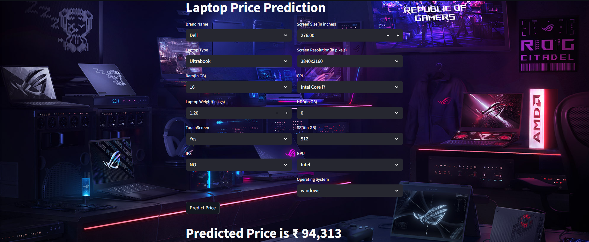
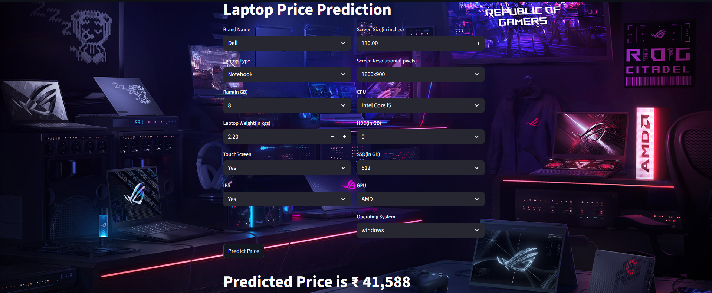
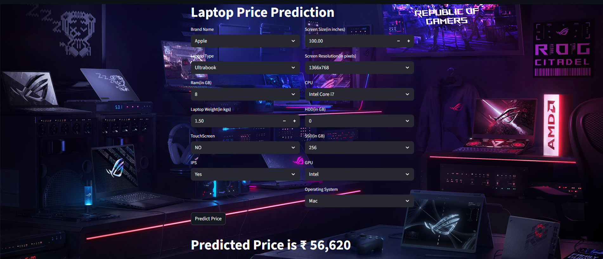

# Laptop Price Prediction

## Problem Statement
Predicting laptop prices is a challenging problem due to the complex interplay of technical specifications, brand value, and feature diversity. The goal of this project is to **analyze laptop features and build a predictive model** capable of estimating the price of a laptop based on its specifications such as RAM, storage, display, CPU/GPU, and operating system.

---

## Why We Use This Technology
- **Python & Pandas/Numpy:** Efficient for data manipulation and preprocessing.  
- **Scikit-learn:** Provides robust tools for preprocessing, feature encoding, and machine learning modeling.  
- **Machine Learning Pipeline:** Ensures a repeatable, clean, and scalable workflow.  
- **Docker & Docker Compose:** Provides an isolated environment to run preprocessing, training, and inference consistently across systems.

---

## Pipeline Steps

1. **Data Collection**
   - Import raw laptop dataset from Excel.

2. **Data Preprocessing**
   - Handle missing values.
   - Correct data types (`Ram`, `Weight`, `Price` → numeric).
   - Standardize units (`GB`, `TB`, `kg`) and formats.
   - Encode categorical variables (`Company`, `TypeName`, `Cpu brand`, `Gpu brand`, `os`).
   - Feature extraction from complex columns (`ScreenResolution` → `Touchscreen`, `IPS`, `ppi`; `Memory` → `HDD`, `SSD`).

3. **Exploratory Data Analysis (EDA)**
   - **Data Inspection:** Check structure, types, and duplicates.
   - **Missing Values Analysis:** Confirm dataset completeness.
   - **Univariate Analysis:** Understand individual feature distributions.
   - **Bivariate Analysis:** Explore feature relationships with `Price`.
   - **Multivariate Analysis:** Examine interactions between multiple features for predictive modeling insights.

4. **Feature Engineering**
   - Create binary flags for display and storage features.
   - Standardize CPU and GPU brands for categorical consistency.
   - Compute derived numeric features like **PPI**.
   - Log-transform target variable (`Price`) to handle skewness.

5. **Data Splitting**
   - Split dataset into training and testing sets using `train_test_split`.

6. **Preprocessing for Modeling**
   - Apply `OneHotEncoder` for categorical features.
   - Save transformer objects for future inference.

7. **Model Training & Evaluation**
   - Use machine learning models (Random Forest, XGBoost, etc.) to predict log-transformed laptop prices.
   - Evaluate performance and visualize predictions.

8. **Results**
   - Final analysis outputs (charts, feature importance) stored in the `output` folder:  
     `output-1.png`, `output-2.png`, `output-3.png`.

---

## Feature Engineering & Preprocessing Highlights

- **RAM & Weight Conversion:** Remove units (`GB`, `kg`) and convert to numeric.
- **Price:** Converted to integer for consistency.
- **ScreenResolution:** Extracted `Touchscreen`, `IPS`, width/height, and calculated `ppi`.
- **CPU Standardization:** Grouped CPUs into `Intel Core i3/i5/i7`, `Other Intel Processor`, and `AMD Processor`.
- **Memory/Storage:** Split multi-storage configs into HDD, SSD layers.
- **GPU:** Extracted brand and removed irrelevant entries (`ARM`).
- **Operating System:** Simplified into `windows`, `Mac`, and `Other/Linux/No OS`.

---


## Running with Docker Compose

1. **Build and start services**:
```bash
docker-compose up --build
```

2. **Access container shell (if needed)**:
```bash
docker exec -it <container_name> /bin/bash
```

3. **Stop services**:
```bash
docker-compose down
```

## Results and Visualizations

The processed data and analysis visualizations are available below:

### Feature Distributions & Correlation Overview


### Univariate & Bivariate Analysis Visualizations


### Multivariate Patterns & Model Insights

